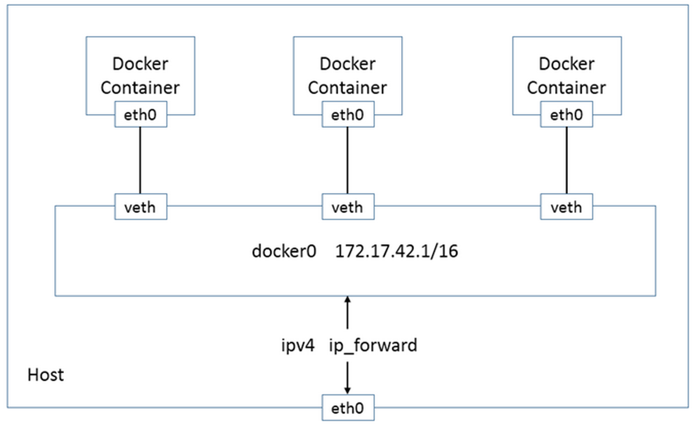

# bridge模式




bridge模式是Docker默认的网络模式。  


# 网络流向分析
宿主机信息:  


宿主机只有一张网卡eth0，其ip信息如下，ip地址为10.12.10.209

```
# ip address show eth0
2: eth0: <BROADCAST,MULTICAST,UP,LOWER_UP> mtu 1500 qdisc pfifo_fast state UP qlen 1000
    link/ether fa:16:3e:0b:f2:a8 brd ff:ff:ff:ff:ff:ff
    inet 10.12.10.209/24 brd 10.12.10.255 scope global dynamic eth0
       valid_lft 82599sec preferred_lft 82599sec
    inet6 fe80::f816:3eff:fe0b:f2a8/64 scope link
       valid_lft forever preferred_lft forever
```

docker0网桥的信息如下:  

```
# ip address show docker0
3: docker0: <BROADCAST,MULTICAST,UP,LOWER_UP> mtu 1500 qdisc noqueue state UP
    link/ether 02:42:00:11:67:dc brd ff:ff:ff:ff:ff:ff
    inet 172.17.0.1/16 scope global docker0
       valid_lft forever preferred_lft forever
    inet6 fe80::42:ff:fe11:67dc/64 scope link
       valid_lft forever preferred_lft forever
```       


宿主机的路由表如下，默认网关是10.12.10.254

```
# ip r
default via 10.12.10.254 dev eth0  proto static
10.12.10.0/24 dev eth0  proto kernel  scope link  src 10.12.10.209
169.254.169.254 via 10.12.10.208 dev eth0  proto static
172.17.0.0/16 dev docker0  proto kernel  scope link  src 172.17.0.1
```


## 容器访问外网
启动容器，并查询容器中网卡的对端设备名称:  


```
# docker run -d centos sleep 3600
4d6b613f1ff9c641c2c4770085f9a70d1179ee871eea3461327d4e537fe7034c

# docker ps
CONTAINER ID        IMAGE               COMMAND             CREATED             STATUS              PORTS               NAMES
4d6b613f1ff9        centos              "sleep 3600"        12 seconds ago      Up 10 seconds                           happy_hoover


# docker inspect --format '{{.State.Pid}}' 4d6b613f1ff9
26215

# nsenter -t 26215 -n -- ethtool -S eth0
NIC statistics:
     peer_ifindex: 110

# ip link | grep 110
110: veth5f89c10: <BROADCAST,MULTICAST,UP,LOWER_UP> mtu 1500 qdisc noqueue master docker0 state UP mode DEFAULT


# brctl show
bridge name	bridge id		STP enabled	interfaces
docker0		8000.0242001167dc	no		veth5f89c10
```


### traceroute


```
# traceroute -n www.baidu.com
traceroute to www.baidu.com (103.235.46.39), 30 hops max, 60 byte packets
 1  172.17.0.1  0.045 ms  0.018 ms  0.016 ms
 2  10.12.10.254  0.392 ms  0.386 ms  0.384 ms
.....
```


### tcpdump

在容器中ping某个外网主机时，用tcpdump监听容器的对端设备vethXXX、docker0网桥和宿主机网卡eth0。


```
# docker exec -it 4d6b613f1ff9 /bin/bash
[root@4d6b613f1ff9 /]# ping -c 3 www.baidu.com
PING www.a.shifen.com (115.239.211.112) 56(84) bytes of data.
64 bytes from 115.239.211.112 (115.239.211.112): icmp_seq=1 ttl=43 time=7.70 ms
64 bytes from 115.239.211.112 (115.239.211.112): icmp_seq=2 ttl=43 time=7.55 ms
64 bytes from 115.239.211.112 (115.239.211.112): icmp_seq=3 ttl=43 time=6.76 ms

--- www.a.shifen.com ping statistics ---
3 packets transmitted, 3 received, 0% packet loss, time 2003ms
rtt min/avg/max/mdev = 6.767/7.342/7.707/0.417 ms


# tcpdump -i veth5f89c10 icmp
tcpdump: WARNING: veth5f89c10: no IPv4 address assigned
tcpdump: verbose output suppressed, use -v or -vv for full protocol decode
listening on veth5f89c10, link-type EN10MB (Ethernet), capture size 65535 bytes
07:23:15.553025 IP 172.17.0.2 > 115.239.211.112: ICMP echo request, id 17, seq 1, length 64
07:23:15.560714 IP 115.239.211.112 > 172.17.0.2: ICMP echo reply, id 17, seq 1, length 64
07:23:16.554990 IP 172.17.0.2 > 115.239.211.112: ICMP echo request, id 17, seq 2, length 64
07:23:16.562523 IP 115.239.211.112 > 172.17.0.2: ICMP echo reply, id 17, seq 2, length 64
07:23:17.556768 IP 172.17.0.2 > 115.239.211.112: ICMP echo request, id 17, seq 3, length 64
07:23:17.563512 IP 115.239.211.112 > 172.17.0.2: ICMP echo reply, id 17, seq 3, length 64


# tcpdump -i docker0 icmp
tcpdump: verbose output suppressed, use -v or -vv for full protocol decode
listening on docker0, link-type EN10MB (Ethernet), capture size 65535 bytes
07:23:15.553025 IP 172.17.0.2 > 115.239.211.112: ICMP echo request, id 17, seq 1, length 64
07:23:15.560712 IP 115.239.211.112 > 172.17.0.2: ICMP echo reply, id 17, seq 1, length 64
07:23:16.554990 IP 172.17.0.2 > 115.239.211.112: ICMP echo request, id 17, seq 2, length 64
07:23:16.562518 IP 115.239.211.112 > 172.17.0.2: ICMP echo reply, id 17, seq 2, length 64
07:23:17.556768 IP 172.17.0.2 > 115.239.211.112: ICMP echo request, id 17, seq 3, length 64
07:23:17.563508 IP 115.239.211.112 > 172.17.0.2: ICMP echo reply, id 17, seq 3, length 64


# tcpdump -i eth0 icmp
tcpdump: verbose output suppressed, use -v or -vv for full protocol decode
listening on eth0, link-type EN10MB (Ethernet), capture size 65535 bytes
07:23:15.553042 IP nl-cloud-dyc-k8s-1 > 115.239.211.112: ICMP echo request, id 17, seq 1, length 64
07:23:15.560700 IP 115.239.211.112 > nl-cloud-dyc-k8s-1: ICMP echo reply, id 17, seq 1, length 64
07:23:16.555011 IP nl-cloud-dyc-k8s-1 > 115.239.211.112: ICMP echo request, id 17, seq 2, length 64
07:23:16.562503 IP 115.239.211.112 > nl-cloud-dyc-k8s-1: ICMP echo reply, id 17, seq 2, length 64
07:23:17.556801 IP nl-cloud-dyc-k8s-1 > 115.239.211.112: ICMP echo request, id 17, seq 3, length 64
07:23:17.563494 IP 115.239.211.112 > nl-cloud-dyc-k8s-1: ICMP echo reply, id 17, seq 3, length 64

```

## 同一个宿主机上两个容器之间互相访问

同一个主机上的容器相互访问不会经过eth0网卡。


