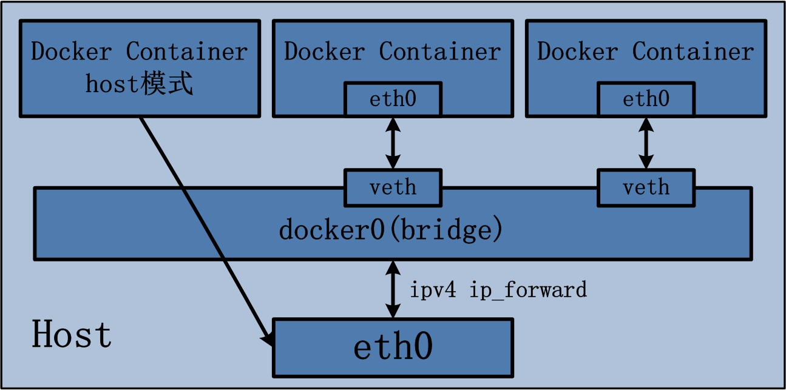

# host模式

启动容器时，使用--net=host选项可以将容器的网络设置为host模式。 

在这种模式下，Docker容器内的进程处于宿主机的网络环境中，和宿主机的网络命名空间一样。





# demo

启动容器并查看容器内进程在根命名空间的进程号:  

```
# docker run -d --net=host nginx:v1.6
6f765ca15cee6b59da43c65fdc7b0f6268bb4014c4dfad1c704889bddcd16570

# docker inspect --format="{{.State.Pid}}" 6f765c
18182
```


对比容器所在的命名空间和根命名空间:  

```
# readlink /proc/1/ns/*
ipc:[4026531839]
mnt:[4026531840]
net:[4026531956]
pid:[4026531836]
uts:[4026531838]

# readlink /proc/18182/ns/*
ipc:[4026532569]
mnt:[4026532567]
net:[4026531956]
pid:[4026532570]
uts:[4026532568]
```

可以看到，容器的网络命名空间和根命名空间是一样的，其他的和根命名空间都不一样。


在容器内执行ip a命令的输出和宿主机上ip a命令的输出是一样的。  


